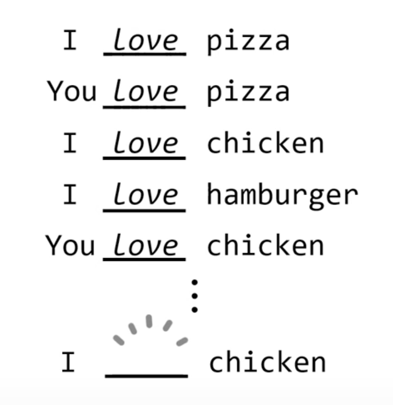
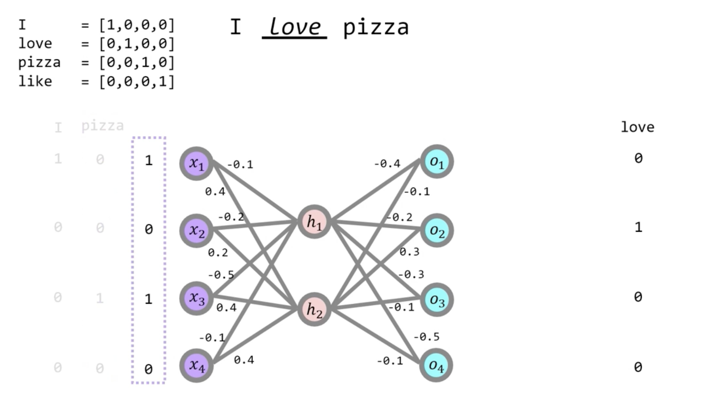
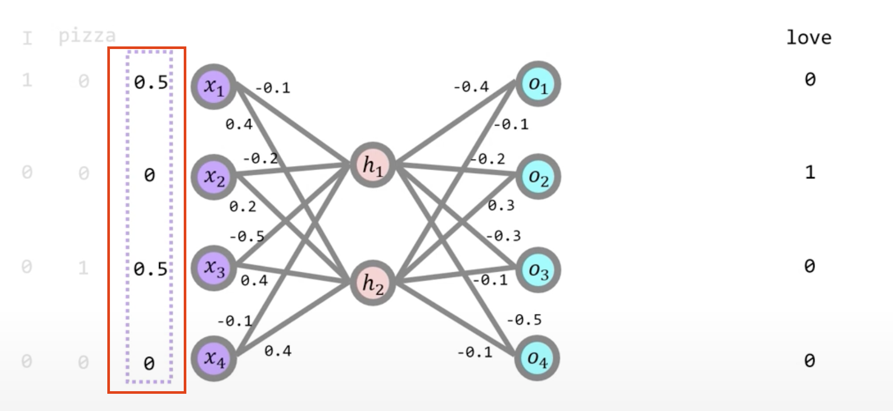
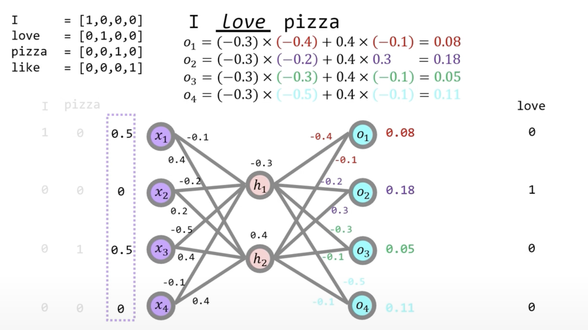
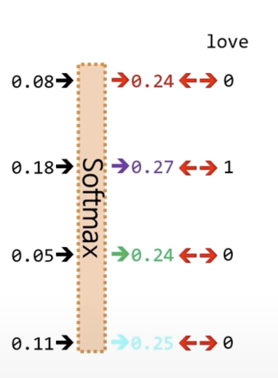
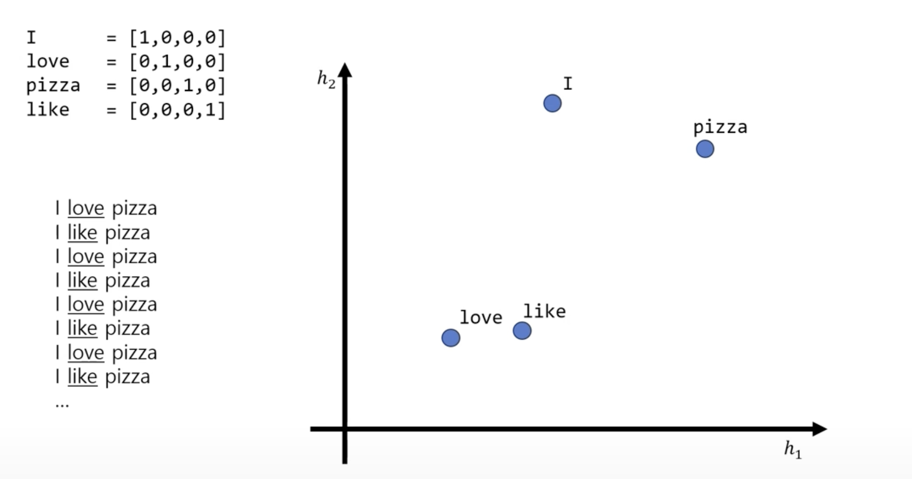
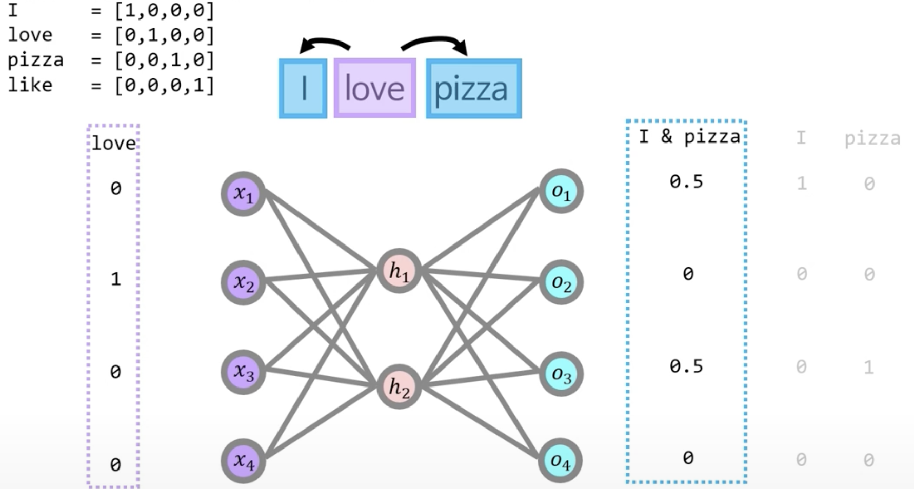
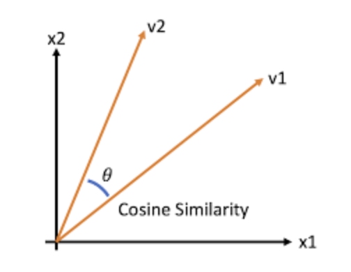

### 공부한 내용 정리 

2024년 12월 30일(월)

## Word2Vec

### 1. 희소 & 밀집 표현 

- 대표적인 기법 → 원-핫 인코딩 
    
    


- 대상이 되는 범주형 변수는 해당 변수 범주 개수(n)만큼의 신규 변수로 쪼개어짐 


- 고차원 행렬 형태로 변환되며 고유 이진 벡터로 표현됨으로 범주간 구분을 명확히함 

- 그러나 각 단어 벡터간 유의미한 유사성을 표현할 수 없는 단점이 있음

### 왜 희소 표현인지?

> 작은 단어의 집합 예제를 통해 표현


**예제** 

- 단어 집합: ["I", "love", "NLP", "ChatGPT", "AI"] 이 있다고 가정할 때 이것을 원-핫 벡터로 표현한다면

    | 단어     | 원-핫 벡터        |
    |----------|-------------------|
    | I        | [1, 0, 0, 0, 0]   |
    | love     | [0, 1, 0, 0, 0]   |
    | NLP      | [0, 0, 1, 0, 0]   |
    | ChatGPT  | [0, 0, 0, 1, 0]   |
    | AI       | [0, 0, 0, 0, 1]   |

    각 벡터는 5차원이며, I가 해당되는 단어만 1을 가지고 나머지는 모두 0을 가지고 있기에, 이렇게 되면 1개만 가지고 나머지는 가지지 못하기에 간단히 설명하면 **희소**하게 되기 때문 


### 더 쉽게 설명하기 위해 

- 실제 언어로 비유 → 예를 들어 단어의 집합이 10,000개가 넘는 데이터를 비교한다고 가정해보자.

    | 단어     | 원-핫 벡터        |
    |----------|-------------------|
    | word1       | [1, 0, 0, 0,..]   |
    | word2   | [0, 1, ..., 0, 0]   |
    | word3    | [0, ..., 1, 0, 0]   |
    | word4  | [0, 0, ..., 1, 0]   |
    | ...       | ..... |
    |   word10,000     | [0, 0, 0,.., 1]   |

각 벡터는 10,000차원인데, 그 중에서 단 1개의 1과 나머지 9,999개의 0을 가지게 되는거면 99개중 1개가 정답이라는 희소성을 가지게 되는거죠?

----

## Pandas를 통한 원-핫 인코딩의 직관적 표현 

- 우리가 `Pandas`를 핸들링 하다 보면 분류 및 회귀 분석을 가지기 전, 데이터들을 머신러닝 모델에 학습하기 좋은 형태로 만들기 위해 문자열을 전처리를 하게 되는데 그 때도 `pd.get_dummies`와 같은 함수를 사용하며 변환할 때 가 있다. 

```python
import pandas as pd

# 예제 데이터: 단어 목록
data = {
    '단어': ['I', 'love', 'NLP', 'ChatGPT', 'AI']
}

# 데이터프레임 생성
df = pd.DataFrame(data)

# 원-핫 인코딩 적용
one_hot_encoded = pd.get_dummies(df['단어'])

# 결과 출력
print(one_hot_encoded)
```

```bash
   AI  ChatGPT  NLP  I  love
0   0        0    0  1     0
1   0        0    0  0     1
2   0        0    1  0     0
3   0        1    0  0     0
4   1        0    0  0     0
```

### 희소표현의 가장 큰 단점? 

1. 차원의 저주 
- 기존의 희소표현을 이용한 원-핫 벡터는 고차원으로 변형하는 과정에서 생기는 `차원의 저주`로 인해 데이터 포인트간의 거리가 멀어지며 그로 인해 학습과 일반화의 성능이 저하됨 

2. 거리 계산의 어려움 
- 더욱 중요한 단어간의 유사성을 통해 문맥을 이해하거나 트랜잭션(번역 등)하는 작업을 할 수 없기에 (0과 1 사이의 값을 어떻게 비교를 합니까?) 
거리 계산을 제대로 할 수 없는 치명적인 단점이 존재


----


### 2. 밀집 표현이란? 
- 기존 원-핫 벡터로 이루어진 고차원의 데이터셋이 아닌 → 저차원의 밀집된 벡터로 표현하는 방식 
- 차원을 낮추는 작업이기에, 원하는대로 차원을 바꿀 수 있고 또한 0과 1의 값이 아닌 실수의 값으로 변형하여 단어간의 유사성을 계산하기 용이하게끔 표현을 학습할 수 있게 한다.

### 대표적인 기법 
`Word2Vec`, `GloVe`, `FastText`

- 오늘은 밀집 표현의 주요 기법인 `Word2Vec`에 대해서만 정리하겠음 

### 대표 기법 2가지 

1. `CBOW` → `Continuous Bag of Words`

- 쉽게 말해서 우리 수능 영어 때 생각하던 **`빈칸추론`**

- 주변 단어를 통해 중심 단어를 추측하는 기법 




#### 신경망 학습 내용 


- 예를 들어서 I love Pizza Like 라는 단어를 신경망을 통해 학습 한다면




- 결국 0 1 0 1의 여러 입력층 값이 베르누이 분포를 생각해봤을 때, `0과 1`로 구분되어야 하기에 
- 0.5+ 0.5 나머지 0 으로 입력 값을 나눠준다. 


### 우리가 알아야 할것 

- `CBOW`, `Skip-gram`은 기존 `MLP`와는 다르게 은닉층과 은닉층 내에서 이루어진 활성화 함수를 사용하지 않고 

- `Softmax` , `Cross-Entropy` 함수를 사용하여 출력 값 내에서만 활성화 함수를 사용 하여 확률값을 단순하게 확인해본다 

    

- 그렇게 가중치를 통해 나온 값을 `softmax`를 거쳐 확률 값으로 계산함.

    

- 그 후 `loss` 값은 `Cross-Entropy`값을 통해 계산하며 미분을 통해 지속적으로 변환해가는 작업을 거친다. 



----

2. `Skip-gram`

- `CBOW`와는 반대로 중심 단어를 통해 주변 단어를 예측하는 형태 




- 이번엔 반대로 주변 단어를 비교하는 값에 가중치를 확률 분포를 통해 1과 0이 아닌 

- 출력층 내 0.5의 값으로 쪼개서 각각 합산하여 0과 1이 될 수 있도록 작성하고 

- 비교하며 `CBOW`때와 똑같이 입력과 출력을 통해 단어간의 유사도 값을 비교한다. 

-----

### 그렇다면 단어간의 유사도는 어떻게 비교하나?

- 단순하게 `Cross-Entropy`를 통해서 계산하는 것이 아니라, 실제 모델의 예측과 실제 타깃 단어간의 차이를 최소하는 함수이지, 단어간의 유사값을 계산하지 않는다. 


### 대표적인 단어간 유사도 값 계산법 


## 1. 코사인 유사도 
- 두 벡터간의 유사성을 측정하는 방법, 두 벡터가 이루는 각도의 코사인을 계산해서 유사성을 평가 

수식 :


$$\text{Cosine Similarity} = \frac{{\mathbf{A} \cdot \mathbf{B}}}{{\|\mathbf{A}\| \|\mathbf{B}\|}}$$

수식 설명 :


A,B는 각 벡터의 내적이고 
$$\|\mathbf{A}\|와 \|\mathbf{B}\|$$
는 각각 벡터 A와 B의 유클리드 노름(Euclidean Norm) 

### 그림으로 표현하면..



#### 특징 
1. 방향에만 중점 : 크기는 무시하고 방향만을 고려 

2. 벡터를 정규화해서 크기의 영향을 제거 

3. -1 1 사이를 가짐, 가까울수록 유사성이 높음 

---

## 2. 유클리드 거리 

- 두 벡터 간의 **직선 거리**를 측정하는 방식으로, 두 점 사이의 실제 거리를 계산, 크기와 방향을 모두 고려해서 유사성을 평가 


$$\text{Euclidean Distance} = \sqrt{\sum_{i=1}^{n} (A_i - B_i)^2}$$


#### 특징 

1. 크기와 방향을 모두 고려 

2. 범위 : 0부터 무한대까지 가짐 → 값이 작을 수록 **유사성이 높다**

3. 직관적인 이해 가능 : 실제 공간에서의 거리랑 비슷하게 생각하면 됨 


### 실제 계산법 


$$\mathbf{A} = [1, 2, 3]$$


$$\mathbf{B} = [4, 5, 6]$$

두 개의 벡터가 있다고 가정할 때, 


$$\text{Euclidean Distance} = \sqrt{(1-4)^2 + (2-5)^2 + (3-6)^2} = \sqrt{(-3)^2 + (-3)^2 + (-3)^2} = \sqrt{9 + 9 + 9} = \sqrt{27} \approx 5.1962$$

- 자세한 설명은 생략한다. 


----

### 번외

1. 노름과 내적은 뭘까?

- 내적 : 벡터끼리 곱셈 

$$\mathbf{A} = [1, 2, 3]$$


$$\mathbf{B} = [4, 5, 6]$$

   
단계 1: 내적 계산


$$\mathbf{A} \cdot \mathbf{B} = (1 \times 4) + (2 \times 5) + (3 \times 6) = 4 + 10 + 18 = 32\$$

- 노름 : 정의 상으로는 길이를 측정하는 방법이라고는 하지만 그냥 루트 씌워놓고 제곱을 통해 계산후 루트를 벗겨줌


$$|\mathbf{A}\|2 = \sqrt{A_1^2 + A_2^2 + \ldots + A_n^2} = \sqrt{\sum{i=1}^{n} A_i^2}$$


