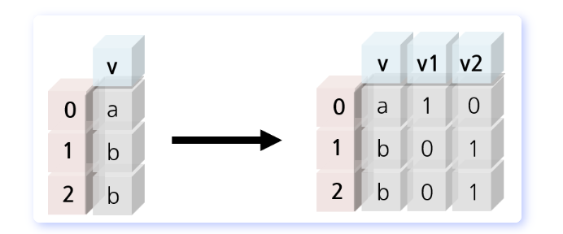

### 공부한 내용 정리 

2024년 12월 30일(월)

## Word2Vec

1. 희소 & 분산 표현 
- 희소 표현이란?
    - 대표적인 기법 → 원-핫 인코딩 
    
    대상이 되는 범주형 변수는 해당 변수 범주 개수(n)만큼의 신규 변수로 쪼개어짐 

    - 고차원 행렬 형태로 변환되며 고유 이진 벡터로 표현됨으로 범주간 구분을 명확히함 

    - 그러나 각 단어 벡터간 유의미한 유사성을 표현할 수 없는 단점이 있음