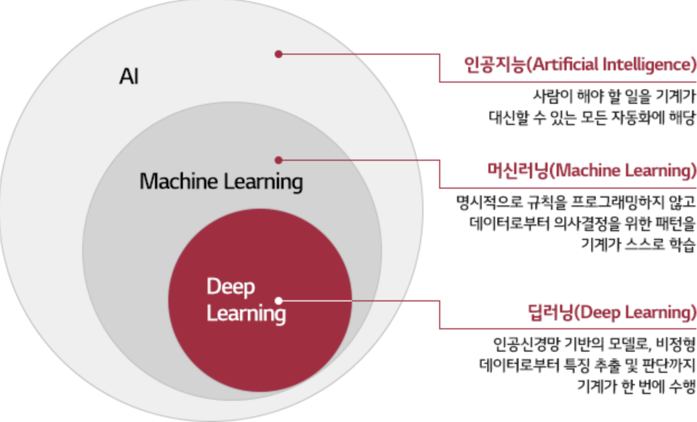
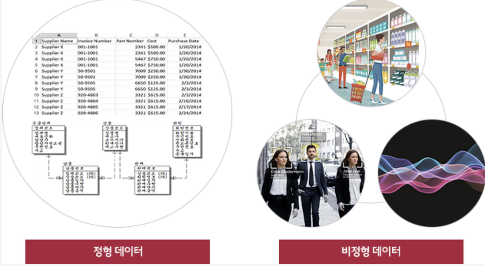
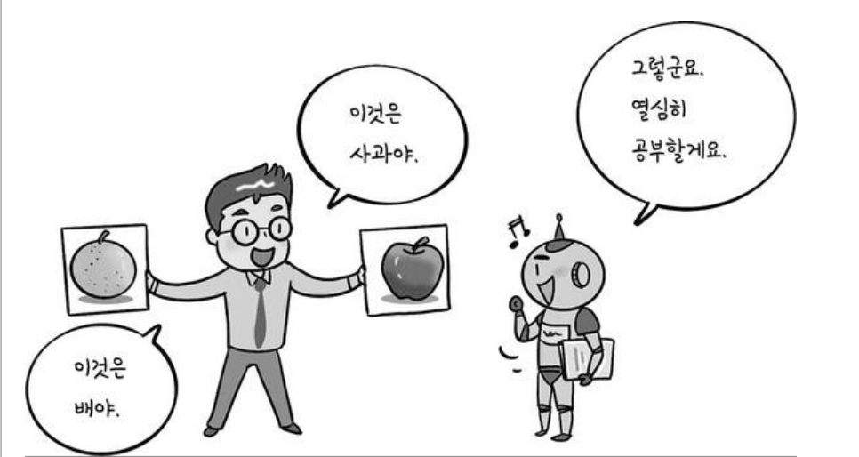
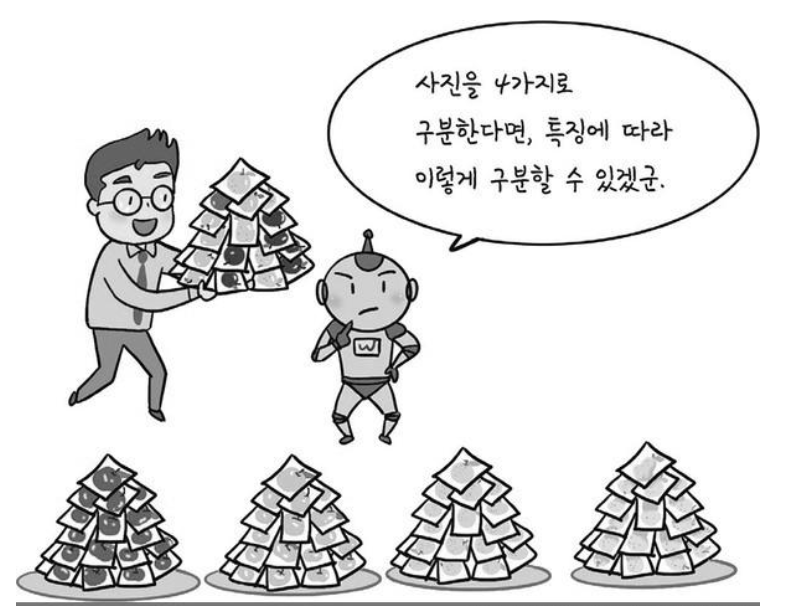
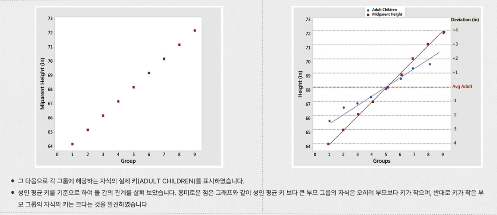
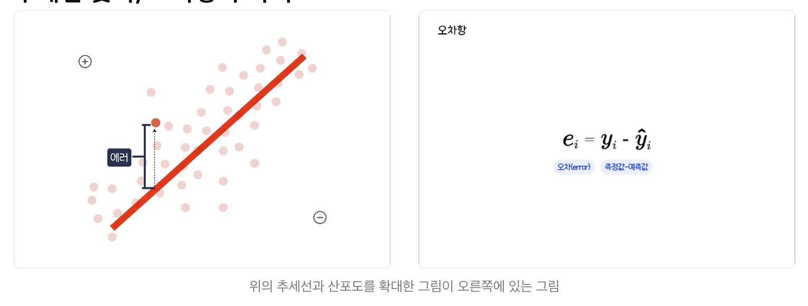
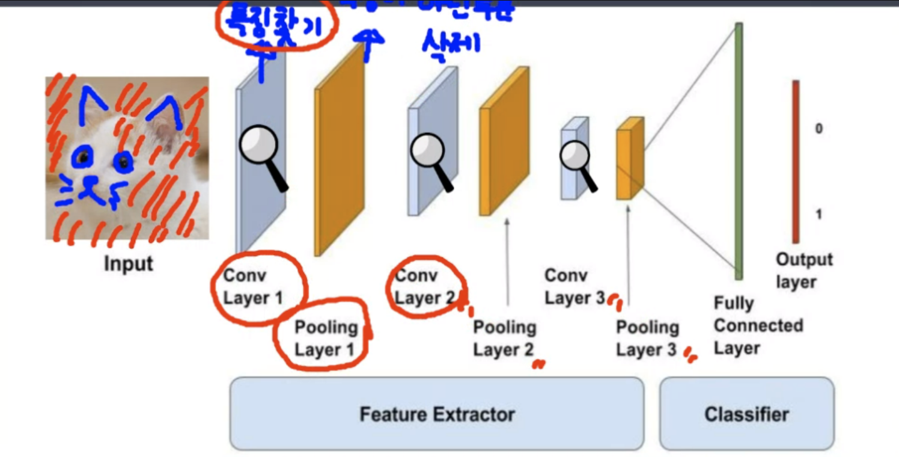

### 머신러닝이란?

인공지능의 하위 집합으로서, 많은 양의 데이터를 제공하여 명시적으로 프로그래밍을 하지 않고 

일정한 패턴을 컴퓨터에게 학습시켜 자율적으로 개선하고 예측할 수 있게끔 도와주는 방법

## 인공지능의 포함관계 

간단하게 생각하자면 
> 인공지능 > 머신러닝 > 딥러닝 

순으로 파생된다고 생각하면 쉽다. 

-----

## 머신러닝의 특징 
1. 주로 정형 데이터를 다룸 
- 정형데이터 : 관계형 데이터베이스나 엑셀 표로 정리되어 있는 테이블 데이터와 유사함

- 비정형 데이터 : 저장된 방식으로 정리 되지 않은 정보 예) 이미지, 비디오, 텍스트 문장이나 문서, 음성 데이터 등 

- 대표기법 : 의사결정나무, 선형회귀, SVR, SVM, 인공신경망, 랜덤포레스트

-----

## 머신러닝의 종류 

1. 지도학습(Supervised Learning)

- 정답이 주어진 환경을 통해 학습시키며 컴퓨터에게 특징을 캐치하게끔 도와주는 방법 

- 예를 들어 다수의 사과 사진 및 배 사진을 통해 컴퓨터에게 해당 오브젝트에 맞는 이름을 지속적으로 학습시켜 Few-shot Learning을 통해 정확도를 추론하게끔 합니다.

----

2. 비지도학습(UnSupervised Learning)

- 정답이 주어지지 않은 상태로 컴퓨터에게 Feature Pattern을 스스로 익히게끔 하여 특성에 따른 분류 하게끔 학습하는 방법 

- 다수의 사진을 통해 데이터의 패턴을 군집(집합) 시키고 그에 따른 라벨을 스스로 붙일 수 있게끔 학습 하는 것이 특징 

- 대표 기법 : 군집분석, 차원축소, 주성분 분석, 인공신경망 등... 많이 있습니다 찾아보면 

------

## 대표 예측법 2가지(회귀, 분류)

1. 회귀분석 
- 종속 변수와 독립 변수간의 관계를 수학적 모델을 통해 설명하고 예측하는 통계적 기법 

- 종속 변수? 독립변수?
    - 쉽게 생각해서 영향을 받는 변수(종속), 영향을 주는 변수(독립)라고 생각하면 쉽습니다 

    - 예를 들어 철수라는 친구가 성적이 떨어지는 요인이 무엇인지 알아보기 위해서 여러 요인들(수면시간, 출석률, 공부시간)이 어떤 영향을 미치는가에 대해 알아 본다는 등...

    - 이를 응용해서 성적을 예측하는 방법도 사용할 수 있습니다.

**수식** 

$$Y = aX + b$$

$$
a : 기울기, 
b : 절편,
X : 독립변수,
Y : 종속변수
$$

**그래프로 표현**

그렇게 구해진 값을 통해 가장 합리적인 추세선(구한 값)을 구하는 방법이 바로 오차항을 구하는 것 

**최소제곱법**
가장 오차가 적은 회귀직선을 구하는 식을 최소제곱법이라고 합니다.

a와 b를 추정하는 방법이며 최소제곱법에 의해 구할 수 있는데요

이렇게 구한 추세선은 평균을 반드시 지나는 특징이 있습니다.

-----

2. 분류 분석
- 회귀와는 다르게, 데이터가 어떤 그룹에 속하는 예측하는데 사용 

- 레코드의 **범주형 속성의 값**을 알아 맞추는 것 

- 예) 카드회사에서 회원들의 가입 정보를 통해 1년 후 신용 등급을 맞추는 것, 고객들의 속성을 활용해서 이탈할지 안할지를 예측 하는 방법 등 

이런 특징들의 패턴을 학습시키며 컴퓨터가 분류할 수 있도록 하는 것이 가장 큰 특징

