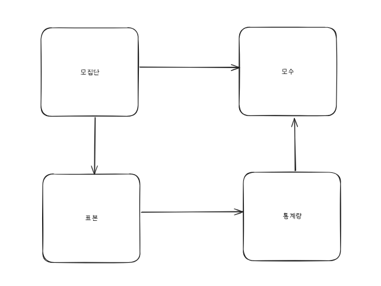
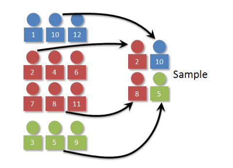
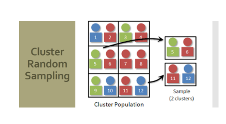

## 머신러닝 활용을 위한 기초 통계 

- 통계란? 

> 특정 집단(표본)을 대상으로 수행한 조사나 실험을 통해 나온 결과에 대한 요약된 형태의 표현 

#### 통계에서 알아야할 기본 용어 

- 간단하게 요약하자면

    - 모집단 : 조사하고자 하는 대상 집단 전체 
    - 표본 : 모집단은 너무 많으니 대표하는 일부 값 추출
    - 모수 : 우리가 알고 싶은 평균값(집단 전체 → ex_한국인 전체, 한국남자 전체)
    - 통계량 : 표본을 통해 추정한 평균값 또는 결과 값 

----

## 표본 획득법 
1. 단순랜덤추출 
    - 각 샘플에 번호를 부여하고 무작위로 n개 추출 

2. 계통 추출법 
    - 임의로 번호를 부여한 샘플을 K개씩 n개의 구간으로 나누고 구간마다 표본을 선택하며 랜덤으로 추출 하는 방법 

3. 군집 추출법 
    - 이질적인 집단을 동질적인 하위 집단으로 나눈 뒤, **일부** 하위 집단을 무작위로 선택하여 표본 추출하는 방식 

4. 층화 추출법 
    - 동질적인 하부 집단으로 나눈 뒤, **모든 층에서 무작위**로 표본 추출

## 그림으로 표현하는 층화와 군집의 차이 

- 층화 추출 

- 군집 추출 

-----

### 기술통계와 통계적 추론 
1. 기술 통계
- 주어진 자료로부터 주관을 제외하고, 여러 특성을 **수량화**하여 객관적인 데이터로 나타내는 것. 

샘플에 대한 특성인 평균, 표준편차, 중위수, 최빈값, 그래프, 왜도, 첨도 등을 구하는 것 

> 대표기법 
>>평균 : 산술평균(대표값), 기하평균

>> 중앙값, 최빈값

>> 산포의 측도 
>> 분산, 표준편차, 사분위수(IQR)

2. 통계적 추론 
- 수집된 자료를 통해 모집단에 대한 추론 및 의사결정을 하는 것 

### 모수추정 
- 모집단의 특성인 모수를 분석하여 추론하는 것 

### 가설검정 
- 대상 집단에 대한 가설을 설정한 후, 그 가설이 옳은지 틀린지에 대해 채택/기각 여부를 결정하는 결정론 

### 예측 
- 미래의 불확실성을 해결해 효율적인 의사결정을 하기 위해 활용 

- 회귀분석, 시계열 분석등 

-----

# 추정
1. 점추정 
- 표본으로부터 미지의 모수를 추축하는 것(모수 자체를 특정한 값으로 추출)
    - 문제점 : 모수를 특정한 값으로 추정하기에는 변수가 너무 많아 오차가 발생할 가능성이 큼 

2. 구간추정 
- 점추정을 보완하기 위해 모수가 특정 구간에 **존재할 것**이라고 추측하는 것 

# 가설검정 
- 모집단에 대한 가설검정을 실시한 뒤, 그 가설의 채택 여부를 채택하는 방법 

- 귀무가설 : "비교하는 값과 차이가 없다 그 가설은 변함이 없다"

- 대립가설 : "비교하는 값의 차이가 발생 한다는 것을 증명 변함이 있다" 

-----

## 확률의 수학적 정의
사건 E에 대한 확률은 P(E) 또는 Pr(E)로 표현하고

다음 4가지 조건을 만족해야지 P를 확률(함수)라고 할 수 있다.

$①\; P(E)\in \mathbb{R}\; \; \; ,\; \mathbb{R}:실수$

$②\; P(E)\ge 0$②P(E)≥0​

$③\; P(\Omega )=1\; \; \; ,\; \Omega:1 \; 발생가능한\; 모든\; 사건$

$$
P(E_1 ∩ E_2 ∩ \cdots) = \sum_{i=1}^{\infty} P(E_i), \quad \text{when } \{E_i\}_{i=1}^{\infty}: \text{서로 독립}
$$

해석하자면 
1. 확률은 실수 값이어야 한다
2. 0이상의 값이 나와야 한다
3. 무조건 발생하는 사건이 있어야한다(=1)
4. 서로 독립적인 사건이어야 한다 

---

# 📚 **조건부 확률 (Conditional Probability)**

**조건부 확률**은 어떤 사건 \( B \)가 일어났을 때, 다른 사건 \( A \)가 일어날 확률을 의미합니다.

---

## 📌 **1. 조건부 확률의 정의**

**수식:**  

$$P(A|B) = \frac{P(A \cap B)}{P(B)}, \quad P(B) > 0$$

**설명:**  
- $$P(A|B) : 사건 B 가 일어났다는 조건 하에서 사건  A 가 일어날 확률$$  
- $$P(A \cap B) : 사건 A와 사건  B 가 동시에 일어날 확률$$  
- $$P(B) : 사건 B가 일어날 확률$$  

---

## 📌 **2. 조건부 확률의 확장**

**교환 법칙 (Commutative Law):**  

$$P(A|B) \cdot P(B) = P(A \cap B) = P(B \cap A)$$

**설명:**  
- 사건 \( A \)와 \( B \)의 교집합의 확률은 조건부 확률과 개별 확률의 곱으로 표현됩니다.  

---

## 📌 **3. 베이즈 정리 (Bayes' Theorem)**

**수식:**  

$$P(B|A) = \frac{P(A|B) \cdot P(B)}{P(A)}, \quad P(A) > 0$$

**설명:**  
- $$P(B|A): 사건 A가 일어났을 때 사건 B 가 일어날 확률$$ 
- $$ P(A|B) : 사건 B 가 일어났을 때 사건 A가 일어날 확률$$

- $$P(B) 사건 B가 일어날 확률 

- $$P(A) : 사건 A 가 일어날 확률$$  

---

**🔑 핵심 요약:**  
1. $$P(A|B) = \frac{P(A \cap B)}{P(B)} $$  
2. $$P(A|B) \cdot P(B) = P(A \cap B)$$  
3. $$P(B|A) = \frac{P(A|B) \cdot P(B)}{P(A)}$$

이 공식을 통해 조건부 확률과 사건의 상호 관계를 이해할 수 있습니다.

