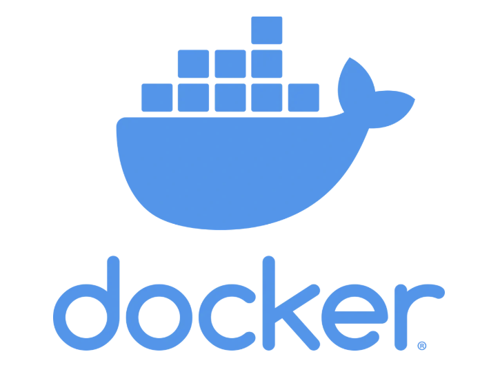
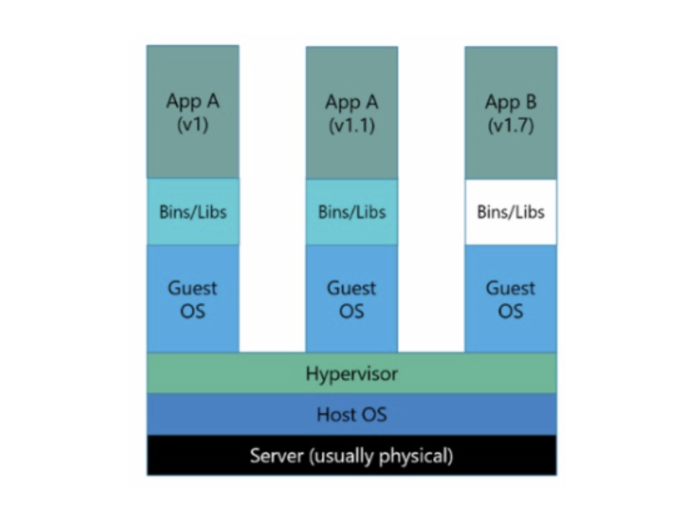
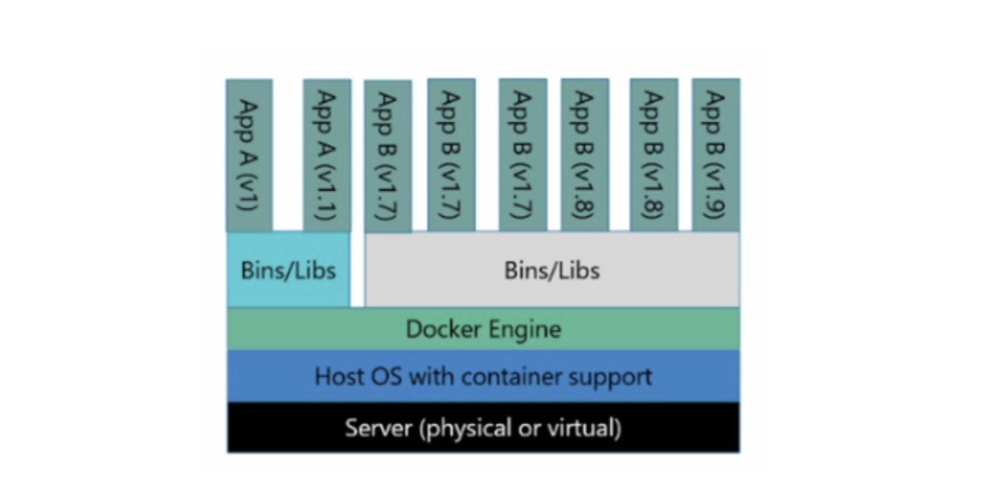
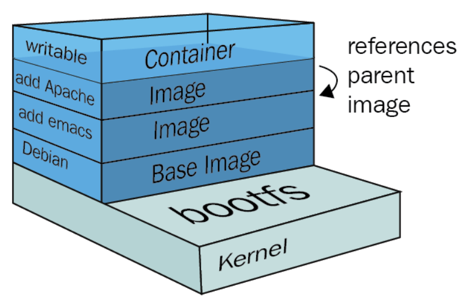

## Docker의 기원 



- 왜 필요하냐? 
    - 그냥 기업에서 많이 씀
    - 종속성 문제를 해결하기 위해서 
    - 프로세스 단위의 가상화 머신 

>A 대리님 저번에 만드신 파일들 이메일로 보내주세요 

실제로 파일을 이메일로 주고 받으면 안되지만, 가끔 내가 만든 파일이 다른 사람 컴퓨터에선 실행되지 못하는 경우가 있는데 

그것을 해결해주는 좋은 툴 

- 원래 가상화 기반 머신은 있었다 



- 물리 서버 위에 Guest OS라는 가상 OS를 껴놓고 운영 

- OS위에 OS를 껴놓으니 헤비함 




가볍고 때에 따라 버려도 나의 시스템엔 아무런 영향도 없고 자원을 분리해서 사용하기 가장 좋음 

----

## Layer 



레이어란 무엇인가? 

- 이미지를 만들 때 여러개의 층을 가진 다수의 스냅샷을 만드는 것 

> 간단하게 생각하자면 이미지만 갖고 오는게 아니라 내 입맛에 맞게 커스텀 해주는 것임 

명령어 모음 

```yaml
FROM: 베이스 이미지를 지정합니다. Dockerfile은 항상 FROM으로 시작합니다.

LABEL: 이미지에 메타데이터(작성자, 설명 등)를 추가합니다.

COPY: 호스트 시스템에서 이미지를 빌드할 때 파일을 복사합니다.

ADD: 파일을 복사하거나 URL에서 파일을 다운로드합니다. (압축 파일을 자동으로 해제 가능)

RUN: 컨테이너 빌드 중 실행될 명령어를 지정하며, 새로운 레이어를 생성합니다

WORKDIR: 컨테이너 내부의 작업 디렉토리를 설정합니다.

ENV: 컨테이너 내부에서 사용할 환경 변수를 설정합니다.

ENTRYPOINT: 컨테이너 시작 시 실행될 기본 명령을 설정하며, CMD와 조합 가능.

EXPOSE: 컨테이너에서 외부로 노출할 포트를 설정합니다.

USER: 컨테이너 내에서 실행할 사용자를 설정합니다.

ONBUILD: 다른 Dockerfile에서 이 이미지를 기반으로 할 때 실행될 명령을 설정합니다.

```

```bash
docker pull python:3.14.0a3-slim
# 이미지 단일 명령 
```

